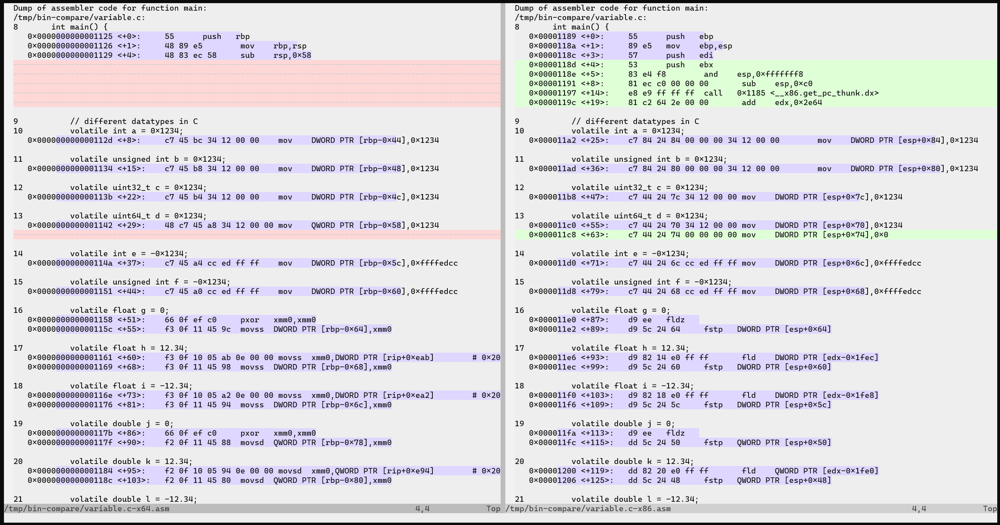

# x86 vs x64

This study helps you understand *how a C program is compiled* (using gcc 9.3.0)
and *what the main differences are between the x86 (32-bit) and x64 (64-bit)
architectures*. These differences matter in practice: the register names,
pointer sizes and especially the calling convention change how you read a
disassembly and how you build a payload (see chapters `0x04` and `0x0A`).

For this study we disable optimisations and enable debug information with the
following compilation flags: `-O0 -ggdb3 --std=c99 -Wall -Wextra -pedantic`

| Difference                                      | x64                                                               | x86                                                  |
| ----------------------------------------------- | ----------------------------------------------------------------- | ---------------------------------------------------- |
| Stack access are relative to:                   | `rbp` - offset                                                    | `esp` + offset                                       |
| `uint64_t` are compiled and stored as:          | `QWORD`                                                           | 2 consecutive `DWORD`                                |
| `float` types are handled by instruction set:   | `*ss`                                                             | `f*`                                                 |
| `double` types are handled by instruction set:  | `*sd`                                                             | `f*`                                                 |
| `float` arguments are handled by registers:     | `xmm*`                                                            | -                                                    |
| `array` intialization                           | values are loaded to stack directly                               | values are loaded from stack and array is duplicated |
| `float` are accessed from:                      | `stack`                                                           | a dedicated section (address)                        |
| `string` are accessed from:                     | the program section, relative to `rip`                            | a dedicated section (address)                        |
| call to parameterless function:                 | assign `eax` to `0` before the call                               | -                                                    |
| method arguments are passed through:            | registers `edi`,`esi`,`edx`,`ecx`,`r8d`,`r9d`, and then the stack | stack only                                           |

## Binary comparer

A binary comparer script is provided in this repository, to use it you must install `libc6-dev-i386` to be able to compile your source code for both x86 & x64 architectures.

In order to run this script, you have to provide both the source file you want to compile and the function name you want to compare:

`./bin-compare.sh function_call.c main`

Here is a screenshot of what you should expect:

