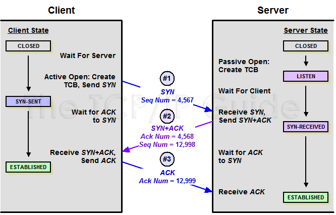

# Network Analyze

## Network interfaces

Every network devices, is asigned a network interface, to interact with it.

However, a loopback (lo) device is available. It is a virtual network interace that your computer use to communicate with itself.

By convention, the IPv4 assigned to this interface is `127.0.0.1` and `::1` for IPv6.

## Protocols

The most common protocols you might encounter are:
* `TCP`: help to understand which process/program on this target machine is expecting to recieve this packet. (data exchange)
* `IP`: determine the target we want to reach (routing).

`TCP/IP` combination is used by the Internet by web browsers/email clients/etc.

## TCP (Transmission Control Protocol)

TCP is a standard that defines how to establish and maintain a network conversation through which application programs can exchange data.

A TCP connection is established through 3 steps, to exchange a sequence number:
* `SYN`: Connection request by client
* `SYN+ACK`: Acknowledgment and connection request by server
* `ACK`: Acknowledgment by client



_Source: http://www.tcpipguide.com/free/t_TCPConnectionEstablishmentSequenceNumberSynchroniz-2.htm_

After connection is established, the sequence number will enable to detect possible loss of packet or be resiliant to timeout.

If the data contained in a paquet is too big to fit in, multiple paquets will be emited. (ending data transmission with a `PSH` flag)

When the initiator is closing the connection, the following sequence is emited to alert the server:
* `FIN`: Disconnection request by client
* `FIN/ACK`: Disconnection & Acknowledgment from the server
* `ACK`: Acknowledgment from the client, that connection had been closed on both sides.

TCP is resiliant to `package loss`, if a paquet had not been aknowledged as recieved, it will be re-emited by the sender. This process could cause some latency issues, as the receiver must wait for the lost packet to be recieved to continue presenting the stream in proper order.

## Wireshark

Wireshark is a network protocol analyzer. It lets you see what’s happening over a network/USB connection.

Download: https://www.wireshark.org/#download

### Filters

When listening the traffic on a network interface, you can encounter a lot a traffic, in order to restraint your analyze to a specific client/server communication you can:
* focus your analyse on a specific protocol
* apply filters, to focus on specific packets

#### Focus on specific protocols

The Enabled Protocols dialog box lets you enable or disable specific protocols. Most protocols are enabled by default. 

To enable or disable protocols select `Analyze → Enabled Protocols`

Documentation: https://www.wireshark.org/docs/wsug_html_chunked/ChCustProtocolDissectionSection.html#ChAdvEnabledProtocols

#### Use filters

Here is a list of simple wireshark filters:

```
tcp.port=42 && tcp.len>0       List packet (containing data) over a TCP connection port 42
```

## Packet Injection

TCP/UDP proxies enables to inspect & forge packets on the fly. Making protocol analysis much easier.

## Proxy Implementation

A sample implemnentation is available in `proxy.py`, it allow packet inspection & injection with code hot reload.

```sh
# Start the proxy
$ ./proxy.py 
127.0.0.1:5000 <-> 127.0.0.1:8000

# Start a server on the port 8000, use -u for UDP
$ nc -l -p 8000

# Connect a client on port 5000, use -u for UDP
$ nc 127.0.0.1 5000
```

The proxy runs in a dedicated thread, allowing the user to type some commands while traffic is inspected:
* `>> [HEX DATA]` Inject hexadecimal encoded data to the server (TCP)
* `<< [HEX DATA]` Inject hexadecimal encoded data to the client (TCP)
* `quit` Stop the inspection, and close connection to both client & server.

Feel free to adapt the code according to your usage.