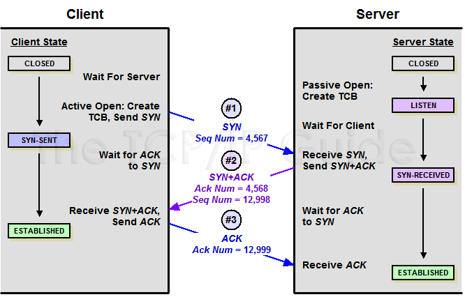

# Network Analyze

## The layered model

Network communication is built in layers, each adding its own header and relying
on the one below. You don't need the full seven-layer OSI model to start; the
practical TCP/IP view is enough:

| Layer | Job | Examples | Addresses by |
|-------|-----|----------|--------------|
| Application | What the data *means* | HTTP, DNS, SSH, TLS | — |
| Transport | Deliver to the right program, reliably or not | TCP, UDP | port number |
| Internet | Get the packet to the right host | IP | IP address |
| Link | Move bytes on the local wire | Ethernet, Wi-Fi | MAC address |

So a web request is HTTP *inside* TCP *inside* IP *inside* Ethernet. When you
analyse traffic in Wireshark you see exactly this nesting, one expandable block
per layer. Knowing which layer a problem (or an attack) lives at tells you which
header and which tool to reach for.

## Network interfaces

Each network device is exposed through a network interface, which you use to
interact with it.

There is also a **loopback** (`lo`) device: a virtual interface a computer uses
to talk to itself. By convention its address is `127.0.0.1` for IPv4 and `::1`
for IPv6. Local services and the proxy example below use it.

## Protocols

The two protocols you meet most often sit at different layers and do different
jobs:

* **IP** (Internet Protocol) decides *which machine* a packet is sent to — it
  handles addressing and routing across networks.
* **TCP** (Transmission Control Protocol) decides *which program on that machine*
  should receive the data — via **port numbers** — and provides a reliable,
  ordered byte stream on top of IP.

Together, `TCP/IP` is what the web, email clients and most internet
applications run on. (The other common transport is **UDP**, which is
connectionless and unreliable but lighter — used for DNS, video, games, etc.)

## TCP (Transmission Control Protocol)

TCP is a standard that defines how to establish and maintain a network conversation through which application programs can exchange data.

A TCP connection is established through 3 steps, to exchange a sequence number:
* `SYN`: Connection request by client
* `SYN+ACK`: Acknowledgment and connection request by server
* `ACK`: Acknowledgment by client



_Source: http://www.tcpipguide.com/free/t_TCPConnectionEstablishmentSequenceNumberSynchroniz-2.htm_

Once the connection is established, sequence numbers let both sides detect lost
packets and recover from timeouts.

If the data is too big for a single packet, it is split across several packets
(the end of a data burst is marked with the `PSH` flag).

When the initiator closes the connection, this sequence is exchanged:
* `FIN`: disconnection request by the client
* `FIN/ACK`: disconnection and acknowledgment from the server
* `ACK`: acknowledgment from the client that the connection is closed on both sides

TCP is resilient to **packet loss**: if a packet is not acknowledged as
received, the sender re-transmits it. This reliability can add latency, since
the receiver must wait for a lost packet before it can hand the stream to the
application in the correct order.

## Common application protocols

Two application-layer protocols you meet constantly:

### DNS (Domain Name System)

DNS translates a human name (`example.com`) into an IP address before any
connection is made. It normally runs over UDP port 53. Because the lookup
usually happens in cleartext and *before* the real traffic, watching DNS is an
easy way to see what hosts a program is trying to reach.

```sh
dig example.com            # query a name (shows the resolved A/AAAA records)
nslookup example.com       # simpler, older equivalent
```

### HTTP (and HTTPS)

HTTP is the request/response protocol the web runs on (chapter `0x12` covers
attacking it). A request names a method and path plus headers; the response
carries a status code and a body. Plain HTTP is readable on the wire; **HTTPS**
is HTTP wrapped in TLS, so a sniffer sees only encrypted bytes unless you can
decrypt it (e.g. by supplying session keys, or via the proxy/pinning-bypass
tricks in chapter `0xFF`).

## Capture tools

Wireshark is the GUI analyzer, but two command-line tools are essential too:

### nmap — what's listening

`nmap` scans a host for open ports and tries to identify the services behind
them. It's usually the first step when probing a target you're authorised to
test.

```sh
nmap -sV 10.0.0.5          # scan common ports, detect service versions
nmap -p- 10.0.0.5          # scan all 65535 TCP ports
```

### tcpdump — capture on the command line

`tcpdump` captures packets without a GUI — ideal on a remote/headless box. Save
to a `.pcap` and open it in Wireshark later.

```sh
sudo tcpdump -i eth0 -w capture.pcap        # capture everything on eth0 to a file
sudo tcpdump -i lo 'tcp port 8000'          # live view, filtered to one port
```

> Capture filters (tcpdump/BPF syntax, applied *while capturing*) are not the
> same as Wireshark's *display* filters (applied after). See `tshark` in chapter
> `0xFD` for scripting extraction from a `.pcap`.

## Wireshark

Wireshark is a network protocol analyzer. It lets you see what’s happening over a network/USB connection. You can **capture live** on an interface (needs
privileges) or **open a saved `.pcap`** file produced by `tcpdump`/`tshark`.

Download: https://www.wireshark.org/#download

### Filters

When listening the traffic on a network interface, you can encounter a lot a traffic, in order to restraint your analyze to a specific client/server communication you can:
* focus your analyse on a specific protocol
* apply filters, to focus on specific packets

#### Focus on specific protocols

The Enabled Protocols dialog box lets you enable or disable specific protocols. Most protocols are enabled by default. 

To enable or disable protocols select `Analyze → Enabled Protocols`

Documentation: https://www.wireshark.org/docs/wsug_html_chunked/ChCustProtocolDissectionSection.html#ChAdvEnabledProtocols

#### Use filters

Here is a list of simple Wireshark display filters:

```
tcp.port == 42 && tcp.len > 0   Packets carrying data on TCP port 42
ip.addr == 10.0.0.5             Any packet to or from 10.0.0.5
http                            Only HTTP traffic
dns                             Only DNS traffic
tcp.flags.syn == 1 && tcp.flags.ack == 0    Connection attempts (bare SYN)
frame contains "password"       Any packet whose bytes contain this string
```

> Tip: right-click a packet and choose *Follow → TCP Stream* to reassemble and
> read an entire conversation as one continuous exchange — very handy for
> plaintext protocols.

## Packet Injection

A TCP/UDP proxy sits between a client and a server and relays traffic, letting
you inspect and even forge packets on the fly. This makes analysing (and
tampering with) a protocol much easier than passive sniffing alone.

## Proxy Implementation

A sample implementation is available in [`proxy.py`](proxy.py); it allows packet
inspection and injection with code hot-reload.

```sh
# Start the proxy
$ ./proxy.py 
127.0.0.1:5000 <-> 127.0.0.1:8000

# Start a server on the port 8000, use -u for UDP
$ nc -l -p 8000

# Connect a client on port 5000, use -u for UDP
$ nc 127.0.0.1 5000
```

The proxy runs in a dedicated thread, allowing the user to type some commands while traffic is inspected:
* `>> [HEX DATA]` Inject hexadecimal encoded data to the server (TCP)
* `<< [HEX DATA]` Inject hexadecimal encoded data to the client (TCP)
* `quit` Stop the inspection, and close connection to both client & server.

Feel free to adapt the code according to your usage.